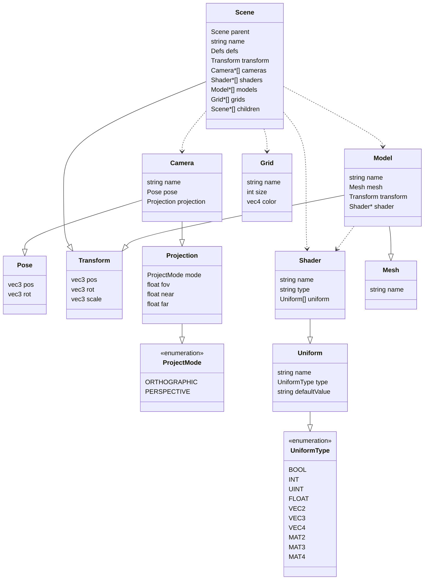

# Scene Nodes

## `scene`

A scene may have at most 1 `grid`.

Attributes

- `name`: `string`

Children

- `transform`
- `camera`
- `shader`
- `model`
- `grid`
- `scene`

```xml
<scene name="root">
    <transform>...</transform>

    <camera>...</camera>
    <shader>...</shader>
    <model>...</model>
    <grid>...</grid>

    <scene>...</scene>
</scene>
```

## `camera`

Attributes

- `name`: `string`

Children

- `pose`
- `projection`

```xml
<camera name="fpv_camera">
    <pose>...</pose>
    <projection>...</projection>
</camera>
```

### `projection`

Children

- `mode`: enum
- `fov`: `float`
- `znear`: `float`
- `zfar`: `float`

```xml
<projection>
    <mode>...</mode>
    <fov>...</fov>
    <znear>...</znear>
    <zfar>...</zfar>
</projection>
```

#### Enum `mode`

- `orthographic`
- `perspective`

## `shader`

If the `ref` attribute is used, the `name` and `type` attributes are not
required. A `ref` shader does not allow for any children.

There should be at most 1 `source` child for each source `type`.

Attributes

- `name`: `string`
- `type`: `string`
- (optional) `ref`: `string`

Children

- `source`
- `uniform`

```xml
<shader name="light" type="mvp">
    <source type="vertex" path="shader/light.vert"/>
    <source type="fragment" path="shader/light.frag"/>

    <uniform name="mvp" type="mat4" />
    <uniform name="lightPos" type="vec3">0 0 0</uniform>
    <uniform name="gamma" type="float">0.2</uniform>
</shader>

<shader ref="light" />
```

### `source`

Currently only `vertex` and `fragment` shader types are supported.

Attributes

- `type`: `string`
- `path`: `string`

```xml
<source type="vertex" path="shader/light.vert"/>
<source type="fragment" path="shader/light.frag"/>
```

### `uniform`

If a value is not provided, it will be set to an appropriate default.

Attributes

- `name`: `string`
- `type`: enum

Children

- (optional) value

```xml
<uniform name="mvp" type="mat4" />
<uniform name="pos" type="vec3">0 0 -1</uniform>
```

#### `type`

- `bool`
- `int`
- `uint`
- `float`
- `vec2`
- `vec3`
- `vec4`
- `mat2`
- `mat3`
- `mat4`

## `model`

Attributes

- `name`: `string`

Children

- `mesh`
- `shader`
- `transform`

```xml
<model name="sphere">
    <mesh path="model/sphere.obj" />
    <shader ref="light" />
    <transform>...</transform>
</model>
```

## `grid`

Each `scene` may have at most 1 grid.

`size` is an integer radius in number of cells.

`color` components values are from 0 to 1 and ordered Red, Green, Blue, Alpha.

Children

- `size`: `int`
- `color`: `vec4`

```xml
<grid>
    <size>10</size>
    <color>0.5 0.5 0.5 1</color>
</grid>
```

## `pose`

Children are 6 float values separated by spaces. There are 3 values for position
(x, y, z) and 3 values for euler rotation (rx, ry, rz).

Children

- 6 float values representing x, y, z, rx, ry, rz

```xml
<pose>5 2 5 0.2 -0.75 0</pose>
```

## `transform`

Each child is optional, and if not specified will have the default values of
`0, 0, 0` for `position` and `rotation` and `1, 1, 1` for `scale`.

Children

- `position`: `vec3`
- `rotation`: `vec3`
- `scale`: `vec3`

```xml
<transform>
    <position>0 1 0</<position>
    <rotation>0.7 -1.25 0</<rotation>
    <scale>1 1 1</<scale>
</transform>
```

# Class Diagram

